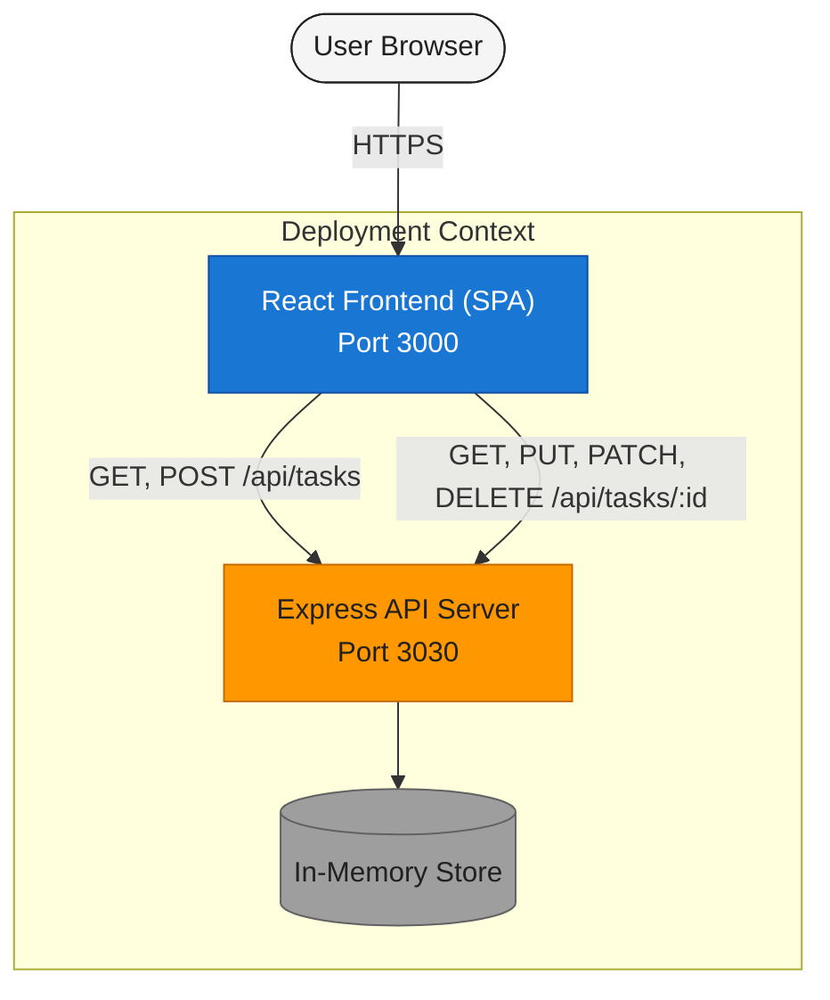
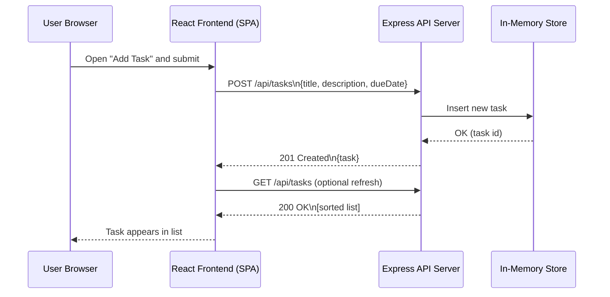

# Cloud Architecture Overview

This document provides a simple system-context view of the monorepo: a React frontend communicating with an Express API backed by an in-memory store.

- Notes:
  - The in-memory store is ephemeral and non-persistent.
  - The frontend interacts with the backend via RESTful endpoints returning JSON.
  - In local development, both services run within the same environment; cloud deployment would place them behind HTTPS.

## Legend
- Client: End-user browser; light gray.
- Web: React frontend SPA; blue (primary).
- API: Express REST API; orange (secondary).
- Data: In-memory store (ephemeral); gray.

## Sequence: Create TODO

